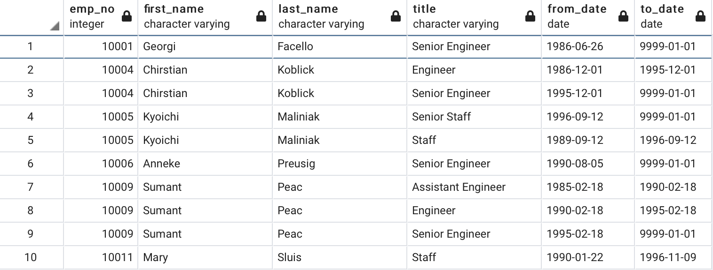
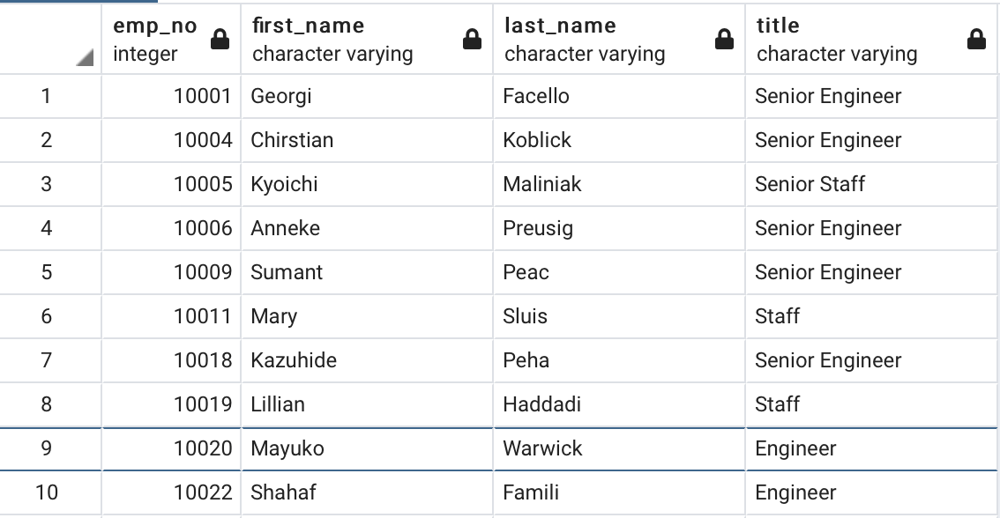
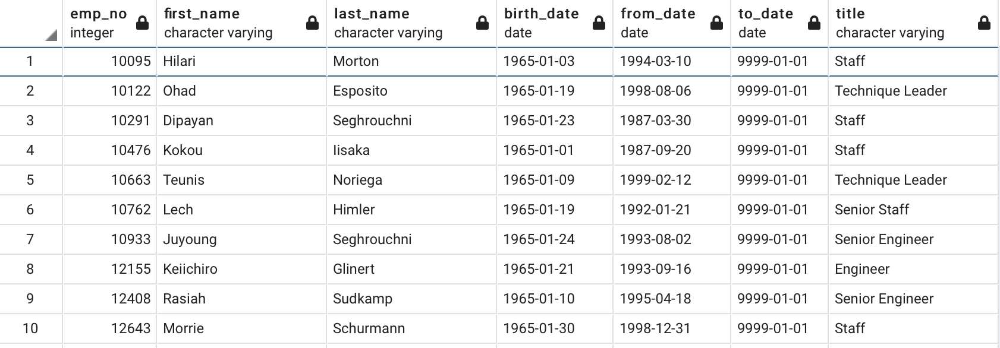
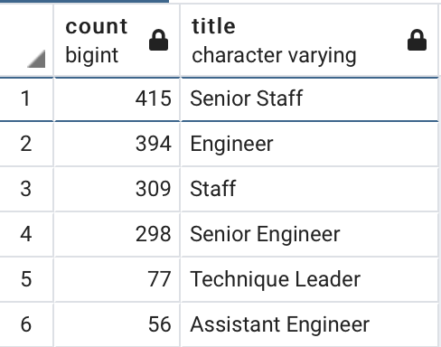

# Pewlett-Hackard-Analysis
Employee Database with SQL

## Overview of the Pewlett Hackard analysis
  - The purpose of this analysis was to act as an HR analyst that would be helping a company, Pewlett Hackard, plan ahead for the future by performing employee research to determine who in the company will be retiring in a few years and how many positions the company will have to fill? This data analysis of employee data was done by using SQL to build a employee database. Additionally, using past knowledge of DataFrames and tabular data, data modeling our employee database by creating an entity relationship diagrams (ERDs) was important in answering the challenge's questions. Creating queries from the imported data and ERD, helped troubleshoot common errors and address the "silver tsunami".
  

## Results from the Pewlett Hackard analysis deliverables
  - **Deliverable 1: The Number of Retiring Employees by Title**
  
  **IMAGE ONE**
  
  **IMAGE TWO**
  
  **IMAGE THREE**
  
  - **Four major points from the first deliverable**
    1. From image one, a table of the employee number, full name, job title, and time with the company is listed. There are duplicate entries for some employees because they have switched titles over the years.
    
    2. From image two, the duplicate name issues is resolved by the usage of the **"DISTINCT ON"** coding statemetn that retrieves the first occurence of the employee number. This new clean and unique table provides the employee number, their full name, and job title. 
    
    3. From image three, a refined table of the number of employees eligible for retirement based on title name. A **"COUNT"** coding statement was used to count every employee based on title, with there being 7 positions with employees up for retirement. From image three one can deduce that, the position of Senior Engineer has the most employees eligible for retirement with 29,414 accounted for. The Senior Staff position had the second most employees eligible for retirement with 28,254 employees. Following suit was the Engineer position with 14,222 employees, the Staff position with 12,243 employees, Technique Leader at 4,502, and the position with the lowest number of employees eligibile for retirement being the Manager position with only 2 employees. 
    
    4. The retirement tables that are demonstrated in the images above were created by employee data from Pewlett Hackard that were queried using SQL. The retrieval of data from the employee databases and data engineering on the analyst's end allowed for the processing of employees eligible for retirement. Employees who were born between January 1, 1952 and December 31, 1955 were identified through are data analysis and subject to the data modeling and data engineering presented from the retirement tables created in deliverable one, and shown in the three images above.
    
  - **Deliverable 2: Employees Eligible for the Mentorship Program**
  **IMAGE ONE**
  
  
  
  **IMAGE TWO**
   
  
  
  - **Four major points from the second deliverable**
    1. From the image above, the table created from deliverable 2 showcases employees born between January 1, 1965 and        December 31, 1965 eligible to be apart of the Mentorship Program of Pewlett Hackard. 
  
    2. 
